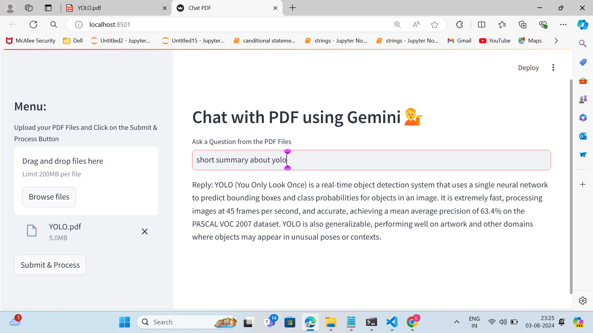
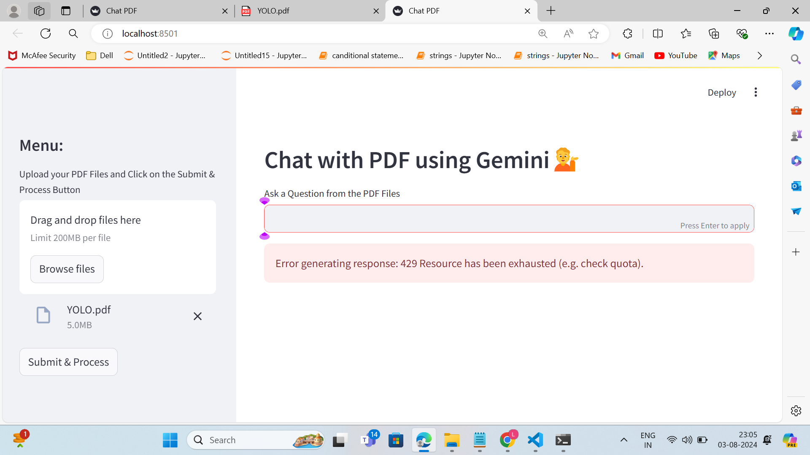

# Chart with Multiple PDFs

## Overview

Welcome to the "Chart with Multiple PDFs" project. This project utilizes Retrieval-Augmented Generation (RAG) to process and analyze PDF documents. The workflow involves converting PDFs to text, chunking the text, embedding the chunks, and storing them in a FAISS vector store. The application uses Google Gemini as the language model and Streamlit for the web interface.

## Project Steps

### Step 1: Convert PDF Documents to Text

We start by extracting text from PDF documents using the `get_pdf_text` function. This function reads the contents of the uploaded PDFs and converts them into a plain text format.

### Step 2: Text Chunking

Once the text is extracted, it is divided into manageable chunks using the `get_text_chunks` function. This step ensures that the text is segmented into smaller pieces for better processing and retrieval.

### Step 3: Text Embedding and Storage

The chunks of text are then converted into embeddings using the `get_vector_store` function. These embeddings are stored in a FAISS vector store, enabling efficient similarity search and retrieval of relevant information.

## Technologies Used

- **Google Gemini Model**: Used as the language model for answering questions based on the context provided by the PDF documents.
- **Streamlit**: A web framework used to create the interactive web application.
- **FAISS**: A library for efficient similarity search and clustering of dense vectors.
- **Langchain**: A framework for working with language models and vector stores.

## Screenshots

Here are some screenshots of the application:

*Figure 1: Application Output*

*Figure 2: API Not Available Error*

